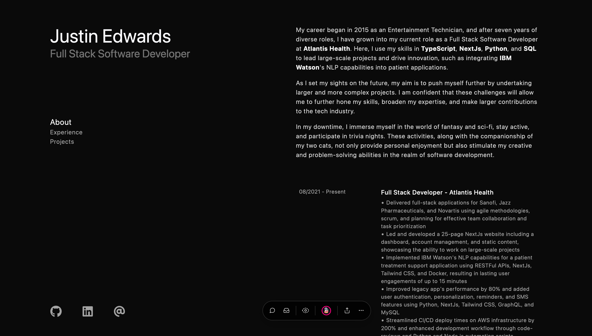

# Personal Website

Landing page with all my links

## Technologies

The website is built using the following technologies:

-   [Next.js](https://nextjs.org/) 13: A framework for building React applications
-   [TypeScript](https://www.typescriptlang.org/): A strongly-typed superset of JavaScript
-   [Tailwind CSS](https://tailwindcss.com/): A utility-first CSS framework

## Background Animation

The background animation is implemented using TypeScript and a 2D \<canvas \/\> element. It is based on the Game of Life cellular automaton algorithm, which simulates the evolution of living cells on a grid.
