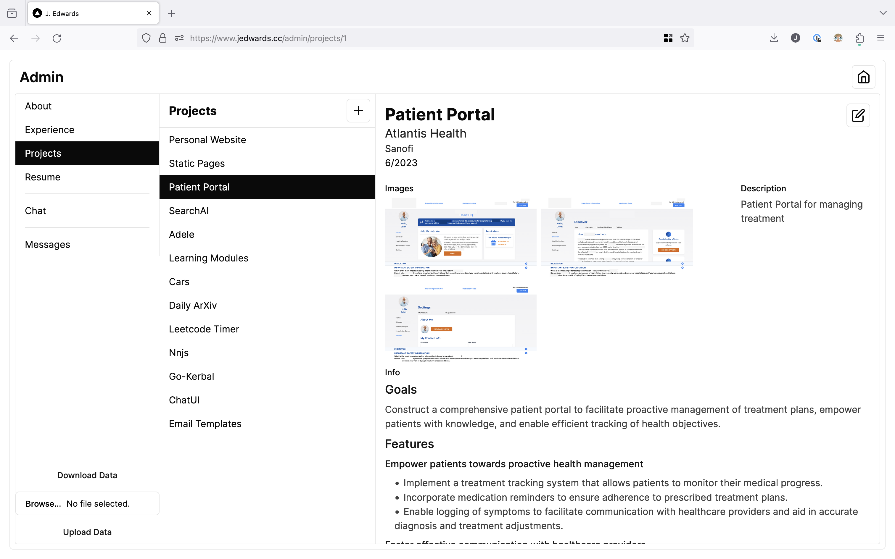

# Personal Website

Landing page with all my links

## Technologies

The website is built using the following technologies:

-   [Remix](https://remix.run/): A full-stack JavaScript framework for the modern web
-   [TypeScript](https://www.typescriptlang.org/): A strongly-typed superset of JavaScript
-   [Tailwind CSS](https://tailwindcss.com/): A utility-first CSS framework
-   [Prisma](https://www.prisma.io/): A database toolkit
-   [Neon Databass](https://neon.tech/): A serverless Postgres database
-   [Plausible](https://plausible.io/): A simple, open-source, lightweight (< 1 KB) and privacy-friendly web analytics system
